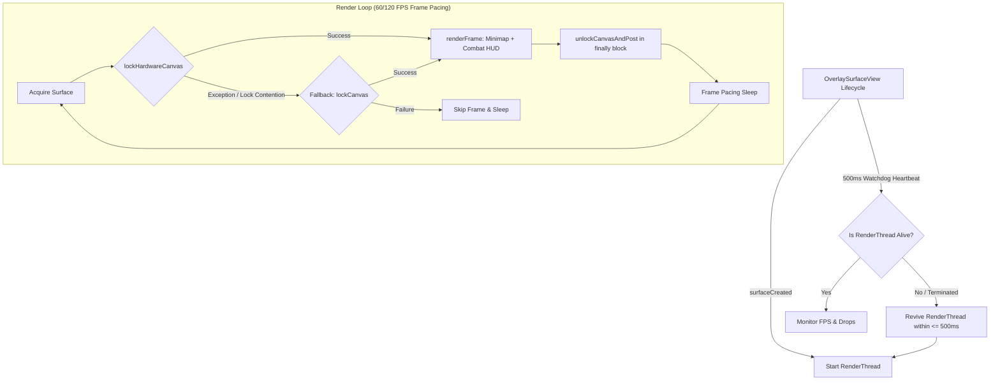

# VEMINS // ESP — Deep Technical Architecture Specification

**Version**: 1.2.0-PROD  
**Target OS**: Android 8.0+ (API 26–36), ARM64-v8a  
**Security Profile**: Read-Only `/proc/$PID/mem`, Zero In-Game Injection, Direct DMA Surface Compositing  

---

## 1. Zero-Injection Telemetry Transport (`vemins_daemon.c`)

### 1.1 Process Discovery & Memory Mapping
The daemon operates with zero injection:
1. **PID Discovery & Process Latching**:
   - Scans `/proc` for `com.mobile.legends` while filtering out `:push`, `:channel`, and auxiliary background workers.
   - Validates process liveness using the kernel syscall `kill(pid, 0)`.
2. **Zero-Syscall Header Verification**:
   - Rather than repeatedly parsing `/proc/$PID/maps` on every frame (which introduces severe I/O overhead and lock contention), the daemon reads the cached `s_libcsharp_base` ELF magic bytes:
     ```c
     uint32_t elf_magic = 0;
     if (pread(s_cached_mem_fd, &elf_magic, 4, s_libcsharp_base) == 4 && elf_magic == 0x464c457f) {
         // Base pointer is 100% valid; skip maps parsing
     }
     ```
3. **Direct Kernel DMA Memory Ingestion**:
   - Ingests entity structures via `pread(mem_fd, buf, size, address)` directly from the kernel virtual address space.

---

## 2. Dynamic Memory Buffer Architecture (`json_buffer_t`)

To mathematically prevent stack buffer overflows and JSON truncation crashes during heavy matches:

```c
typedef struct {
    char *data;
    size_t len;
    size_t cap;
} json_buffer_t;

static inline bool json_buf_ensure_capacity(json_buffer_t *buf, size_t needed) {
    if (buf->len + needed + 1 > buf->cap) {
        size_t new_cap = (buf->cap * 2 > buf->len + needed + 1024) ? 
                          buf->cap * 2 : buf->len + needed + 1024;
        char *new_data = (char *)realloc(buf->data, new_cap);
        if (!new_data) return false;
        buf->data = new_data;
        buf->cap = new_cap;
    }
    return true;
}
```

### Strict Floating-Point Clamping (`safe_float`):
```c
static inline double safe_float(double v, double fallback, double min_v, double max_v) {
    if (!isfinite(v) || isnan(v)) return fallback;
    if (v < min_v) return min_v;
    if (v > max_v) return max_v;
    return v;
}
```
All entity coordinates (`pos_x`, `pos_y`), velocities, and cooldowns are passed through `safe_float()`, preventing `nan` or `inf` tokens from corrupting JSON serialization.

---

## 3. Overlay Engine & Self-Healing Lifecycle (`OverlaySurfaceView.kt`)



### 3.1 Fault-Tolerant Rendering Safety
1. **Top-Level `Throwable` Enclosure**: All frame rendering operations are wrapped in `try-catch (t: Throwable)` so `OutOfMemoryError` or framework-level exceptions never kill the thread.
2. **Multi-Tiered Canvas Locking**: Falls back from `lockHardwareCanvas()` to standard `lockCanvas()` automatically. Canvas unlock is guaranteed via `finally { surfaceHolder.unlockCanvasAndPost(canvas) }`.
3. **Persistent Local Player Camera Anchoring**:
   - `lastKnownLocalX` and `lastKnownLocalY` are smoothed with an Exponential Moving Average (EMA $\alpha = 0.35f$).
   - When `localPlayer` becomes null on hero respawn or round transition, the camera anchors to the smoothed last known position for continuous HUD tracking.

---

## 4. Coordinate Projection & Mathematical Foundations

### 4.1 Minimap Transformation & 45° Diamond Transform
The in-game MLBB map is centered at $(0, 0)$ with a coordinate span of $[-60.0, +60.0]$ in both axes:

$$\begin{aligned}
\text{Normalized X: } u &= \frac{X - \text{MIN\_X}}{\text{MAX\_X} - \text{MIN\_X}} = \frac{X + 60}{120} \\
\text{Normalized Y: } v &= \frac{Y - \text{MIN\_Y}}{\text{MAX\_Y} - \text{MIN\_Y}} = \frac{Y + 60}{120}
\end{aligned}$$

For **45° Diamond Mode** (rotated radar):
$$\begin{aligned}
u_{\text{rot}} &= 0.5 + (u - 0.5) \cos(45^\circ) - (v - 0.5) \sin(45^\circ) \\
v_{\text{rot}} &= 0.5 + (u - 0.5) \sin(45^\circ) + (v - 0.5) \cos(45^\circ)
\end{aligned}$$

Screen pixel coordinates on the radar viewport are mapped as:
$$\begin{aligned}
\text{ScreenX} &= \text{MinimapPosX} + (u_{\text{rot}} \times \text{MinimapWidth}) \\
\text{ScreenY} &= \text{MinimapPosY} + ((1.0 - v_{\text{rot}}) \times \text{MinimapHeight}) \quad \text{[with Invert Y]}
\end{aligned}$$

---

### 4.2 3D World-to-Screen Isometric Projection
Calculates on-screen target coordinates relative to the local player:

$$\begin{aligned}
dx &= \text{TargetX} - \text{LocalX} \\
dy &= \text{TargetY} - \text{LocalY} \\
\text{isoX} &= (dx - dy) \times \frac{\sqrt{2}}{2} \\
\text{isoY} &= (dx + dy) \times \frac{\sqrt{2}}{2} \times 0.60 \quad \text{[Foreshortened Pitch]} \\
\text{ScreenX} &= \text{CenterScreenX} + (\text{isoX} \times \text{ScaleX}) \\
\text{ScreenY} &= \text{CenterScreenY} - (\text{isoY} \times \text{ScaleY}) - \text{OverheadLift}
\end{aligned}$$

#### Mathematical Safe Clamping (`safeCoerceIn`):
Prevents `IllegalArgumentException: Cannot coerce value to an empty range` when view dimensions are initializing ($min > max$):
```kotlin
fun Float.safeCoerceIn(minVal: Float, maxVal: Float): Float {
    if (this.isNaN()) return minVal
    val actualMin = kotlin.math.min(minVal, maxVal)
    val actualMax = kotlin.math.max(minVal, maxVal)
    return this.coerceIn(actualMin, actualMax)
}
```

---

## 5. Telemetry & Control IPC Specifications

| Channel | Endpoint | Protocol | Payload Format | Direction |
| :--- | :--- | :--- | :--- | :--- |
| **Telemetry Ingestion** | `127.0.0.1:9999` | TCP Stream | JSON (`FrameSnapshot`) @ 60/120 FPS | Daemon $\rightarrow$ Overlay App |
| **REST Control API** | `127.0.0.1:8888` | HTTP/REST | JSON (`/api/status`, `/api/config`, `/api/ping`) | Local / External $\leftrightarrow$ Overlay App |

### Telemetry JSON Snapshot Schema:
```json
{
  "agent": "vemins_daemon",
  "version": "1.0.0-ESP",
  "build_hash": "b8f5adf8f12f3f60",
  "status": "ok",
  "pid": 24911,
  "liblogic_base": "0x7b4a200000",
  "libcsharp_base": "0x7b4c800000",
  "timestamp": 1724345000,
  "in_match": true,
  "battle_state": 4,
  "frame_time_ms": 16,
  "local_player": {
    "camp": 1,
    "team": 1,
    "hero_id": 18,
    "hp": 4820,
    "max_hp": 5300,
    "pos_x": 12.45,
    "pos_y": -8.20,
    "facing_x": 0.85,
    "facing_y": -0.52
  },
  "enemies": [ ... ],
  "allies": [ ... ],
  "soldiers": [ ... ],
  "monsters": [ ... ],
  "towers": [ ... ]
}
```
