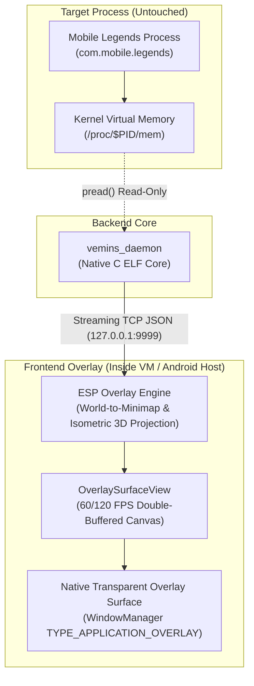

# VEMINS ESP — System Architecture & Visual Design Specification

**Version**: 1.2.0-PROD  
**Design Theme**: Obsidian Void & Stark White (Industrial Monochrome)  
**Target Platform**: Android ARM64 (API 26–36)  
**Security Profile**: Read-Only `/proc/$PID/mem`, Zero In-Game Injection, Direct DMA Surface Compositing  

---

## 1. System Architecture Overview

All game data is obtained exclusively through the verified, read-only memory transport running on `127.0.0.1:9999`. The architecture is split cleanly into decoupled subsystems:



---

## 2. Visual Layout Specifications

The visual interface is strictly divided into **two decoupled render layers** so the minimap remains clear while deep tactical data appears directly on your active gameplay view.

```
┌─────────────────────────────────────────────────────────────────────────────────────────────┐
│ ┌──────────────────────┐                                                                    │
│ │   LAYER 1: MINIMAP   │  ◄── Top-Left Viewport Radar                                       │
│ │  ┌────────────────┐  │      • Enemy & Ally Hero dots + Direction Vectors                  │
│ │  │ [18]➔      [81]│  │      • Lane Minion Waves (Blue/Red dots)                           │
│ │  │       [Lord]   │  │      • Jungle Creeps & Boss respawn timers                         │
│ │  │ [14]       [7] │  │      • 45° Diamond rotation mode & Y-axis inversion               │
│ │  └────────────────┘  │                                                                    │
│ └──────────────────────┘                                                                    │
│                                                                                             │
│                                           ┌──────────────────────────────────────────────┐  │
│                                           │  [Flicker: 42s]   [Ult: 15s]   [S2: READY]   │  │
│                                           │  [████████████████████░░░░] 4,280 / 5,385 HP │  │
│                                           │             (Enemy Hero #14)                 │  │
│                                           │                    ▼                         │  │
│                                           │            [ 3D Hero Model ]                 │  │
│                                           └──────────────────────────────────────────────┘  │
│                                                              ▲                              │
│                                                              │                              │
│  ◄ [Ling 14m]                                                └── LAYER 2: OVERHEAD WORLD ESP│
│  (Off-Screen Edge Radar)                                         • Over Enemy's 3D character│
│                                                                  • Live HP bar & Shield     │
│                                                                  • Ult & Spell CD Badges    │
└─────────────────────────────────────────────────────────────────────────────────────────────┘
```

---

### Layer 1: Minimap Viewport Overlay (Top-Left)

The minimap overlay is anchored to the in-game radar box (default: `75, 15, 320x320` px).

| Element | Visual Appearance | Telemetry Source |
| :--- | :--- | :--- |
| **Enemy Heroes** | Crimson circular icon (radius `9.0px`) with Hero ID / Portrait and facing vector arrow. | `Snapshot.enemies` (`pos_x`, `pos_y`, `facing_x`, `facing_y`) |
| **Allied Heroes** | Subdued Slate circular icon (radius `8.0px`) with friendly direction indicator. | `Snapshot.allies` |
| **Local Hero (Self)** | Emerald circular icon with distinct heading arrow. | `Snapshot.local_player` |
| **Minion Waves** | Small dots (radius `3.5px`): Blue for friendly minions, Red for enemy minions. | `Snapshot.soldiers` (`m_SoldierList` +0x128) |
| **Jungle Creeps & Bosses** | Purple/Yellow objective icons (radius `7.0px`) marking Lord, Turtle, and Buffs. | `Snapshot.monsters` (`m_dicMonsterLogic` +0x0b0) |

---

### Layer 2: Main In-Game Screen World ESP (Overhead & Off-Screen)

Renders dynamic 2D HUD badges projected from 3D world coordinates onto your main screen view.

#### 1. Overhead Combat HUD (On-Screen Enemies)
Displayed directly above each visible enemy hero's head:
* **Health & Shield Bar**:
  * Dual-layer bar showing current HP (Green/Red) and active Shields (White/Cyan).
  * Text readout: `Current HP / Max HP` and level indicator badge.
* **Ultimate & Skill Cooldown Badges**:
  * Circular badge with countdown ring in seconds.
  * Shows `READY` when cooldown reaches 0.
* **Battle Spell Tracker**:
  * Displays active summoner spell (Flicker, Retribution, Purify, Flameshot) with cooldown countdown.

#### 2. 360° Off-Screen Perimeter Edge Radar
When an enemy is outside the active screen viewport but within detection range ($< 45\text{m}$):
* A sharp directional chevron appears clamped to the screen edge.
* Displays the enemy hero portrait, hero name, and exact distance in meters (`28m`).

---

## 3. UI Color Palette & Design Tokens

| Semantic Token | Hex Value | Usage |
| :--- | :--- | :--- |
| `vemins_bg_dark` | `#000000` | Deepest pitch-black background |
| `vemins_bg_void` | `#0C0C0C` | Matte terminal backdrop |
| `vemins_card_bg` | `#141414` | Clean dark charcoal card surface |
| `vemins_card_bg_elevated` | `#1C1C1E` | Elevated card & button surface |
| `vemins_border` | `#2C2C2E` | 1px hairline zinc structural border |
| `vemins_white` | `#FFFFFF` | Stark pure white text, active tab pills, and slider progress |
| `vemins_text_secondary` | `#A1A1A6` | Clean neutral gray labels |
| `vemins_text_muted` | `#636366` | Secondary telemetry units |
| `vemins_tactical_green` | `#30D158` | Live connection / full health |
| `vemins_tactical_red` | `#FF453A` | Low health / daemon disconnected |
